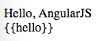

AngularJS1 Directive "Terminal" Issue Demo
==========================================

If a directive have `terminal:true`, the expressions won't be rendered.

```
npm install
open index.html
```



Resources
---------

- directive `terminal` api: <https://docs.angularjs.org/api/ng/service/$compile#-terminal->